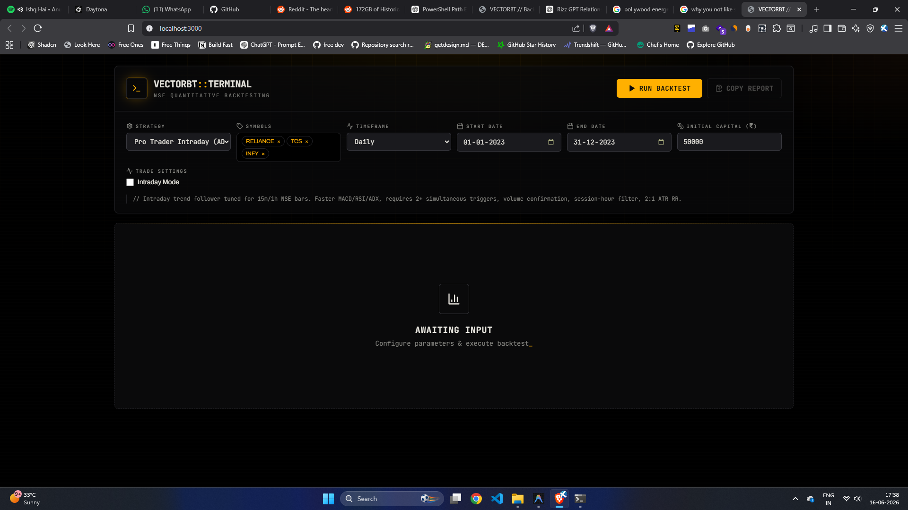

# VectorBT // Backtesting Terminal

A full-stack quantitative backtesting platform for Indian equities. FastAPI backend powered by [VectorBT](https://vectorbt.dev/) + Next.js amber-phosphor terminal UI. Integrates with **Fyers API v3** for live OHLCV data with automatic `yfinance` fallback.



---

## Features

- **Accurate backtesting** — NSE-realistic fee model (STT + exchange + stamp + SEBI + GST + brokerage), correct Sharpe annualization for intraday (94,500 trading min/yr) vs daily (252 days)
- **Fyers API v3** — live OHLCV data for NSE equities; falls back to yfinance automatically
- **Candlestick chart** — lightweight-charts OHLC with buy/sell markers per symbol
- **Equity & drawdown curves** — portfolio-level Recharts area charts
- **Per-symbol breakdown** — win rate, PnL, fees per symbol
- **Trade log** — filterable table with entry/exit prices, fees, return %
- **Pluggable strategies** — add new strategies by extending `BaseStrategy`

---

## Stack

| Layer | Tech |
|-------|------|
| Backend | Python 3.12, FastAPI, VectorBT, pandas |
| Data | Fyers API v3, yfinance fallback, parquet cache |
| Frontend | Next.js 14, Tailwind CSS, Recharts, lightweight-charts |
| Package manager | uv |

---

## Setup

### Prerequisites
- Python 3.12+ with [uv](https://docs.astral.sh/uv/)
- Node.js 18+
- Fyers API account ([dashboard](https://myapi.fyers.in/dashboard))

### Backend

```powershell
# Install deps
uv sync

# Create backend/.env
FYERS_APP_ID=YOUR_APP_ID-100
FYERS_SECRET_KEY=YOUR_SECRET_KEY
FYERS_REDIRECT_URI=http://127.0.0.1:5000/
FYERS_ACCESS_TOKEN=

# Generate access token (opens browser, saves token to .env automatically)
uv run python -m backend.fyers_auth_helper

# Run server
uv run uvicorn backend.main:app --reload --port 8000
```

> Token expires daily ~08:00 IST. Re-run `fyers_auth_helper` to refresh. Missing token falls back to yfinance.

### Frontend

```powershell
cd frontend
npm install
npm run dev   # http://localhost:3000
```

### Start both together

```powershell
.\run.ps1
```

---

## Adding a Strategy

1. Create `strategies/my_strategy.py` extending `BaseStrategy`
2. Implement `generate_signals(self) -> tuple[pd.DataFrame, pd.DataFrame]` — returns `(entries, exits)` boolean DataFrames with symbol columns
3. Register in `backend/main.py`:
   ```python
   from strategies.my_strategy import MyStrategy
   STRATEGY_MAP = { "my_strategy": MyStrategy, ... }
   ```

---

## Project Structure

```
backend/        FastAPI app, VectorBT engine, Fyers client, data cache
frontend/       Next.js SPA — three tabs: Overview, Symbols, Trades
strategies/     Pluggable strategy modules (extend BaseStrategy)
scripts/        Dev/ops utilities
```
